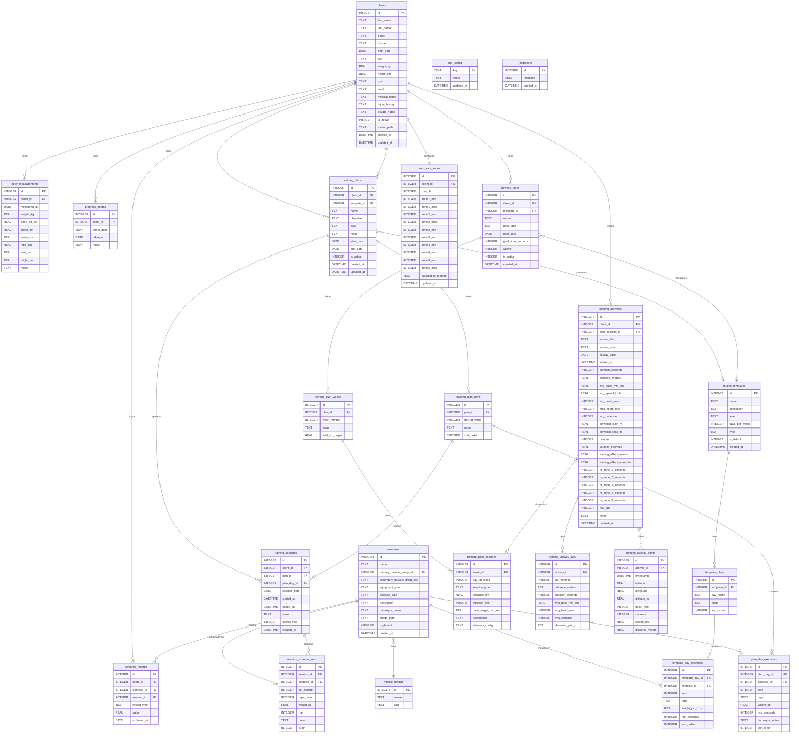

# REQUIREMENTS.md — App de Seguimiento de Entrenamiento

Documento de arquitectura y requerimientos. Leer junto a `CLAUDE.md`.

---

## 1. Requerimientos Funcionales

### 1.1 Gestión de Clientes

| ID | Requerimiento |
|----|--------------|
| CL-01 | CRUD completo de clientes: nombre, apellido, email, teléfono, fecha de nacimiento, sexo |
| CL-02 | Datos físicos por cliente: peso (kg), altura (cm), objetivo, nivel (principiante / intermedio / avanzado) |
| CL-03 | Historial médico y lesiones como texto libre; notas privadas del entrenador |
| CL-04 | Registro de mediciones corporales con fecha: peso, % grasa, circunferencias |
| CL-05 | IMC calculado automáticamente al tener peso y altura |
| CL-06 | Galería de fotos de progreso con fecha |
| CL-07 | Un cliente puede tener simultáneamente un plan de gimnasio activo y un plan de running activo |
| CL-08 | Dashboard por cliente: resumen de progreso, últimas sesiones, próxima sesión programada |
| CL-09 | Alerta visual si el cliente no registra actividad en N días (N configurable por entrenador) |
| CL-10 | Exportar informe de progreso del cliente en PDF |
| CL-11 | Activar / desactivar clientes sin borrarlos (soft delete) |

### 1.2 Biblioteca de Ejercicios

| ID | Requerimiento |
|----|--------------|
| EJ-01 | Ejercicios con: nombre, grupo muscular principal, grupos secundarios, tipo de equipamiento, descripción de técnica |
| EJ-02 | Filtros: grupo muscular, tipo de equipamiento, búsqueda por nombre |
| EJ-03 | Ejercicios precargados marcados como `is_default`; no se pueden eliminar, sí editar su descripción / imagen |
| EJ-04 | El entrenador puede agregar ejercicios propios y eliminarlos |
| EJ-05 | Imagen o ícono por ejercicio (ruta local o placeholder SVG) |

### 1.3 Módulo Gimnasio — Planes

| ID | Requerimiento |
|----|--------------|
| GY-01 | Crear plan de entrenamiento por cliente con nombre, objetivo, nivel, fechas inicio/fin |
| GY-02 | Definir días del plan: día de la semana + nombre (ej: "Pecho + Tríceps") |
| GY-03 | Agregar ejercicios a cada día: series, repeticiones (texto libre, ej: "8-12"), peso objetivo (kg), descanso (seg), notas |
| GY-04 | Reordenar ejercicios dentro del día con drag & drop |
| GY-05 | Crear plan desde una plantilla de rutina; el entrenador personaliza desde ahí |
| GY-06 | Marcar un plan como activo / inactivo; historial de planes anteriores conservado |

### 1.4 Módulo Gimnasio — Sesiones

| ID | Requerimiento |
|----|--------------|
| GY-10 | Registrar sesión de entrenamiento vinculada a un plan/día o libre |
| GY-11 | Por cada ejercicio: sets completados con peso real, reps reales, RPE (1–10) |
| GY-12 | Calcular y mostrar volumen total por sesión (suma de sets × reps × kg) |
| GY-13 | Calcular volumen por grupo muscular en la sesión |
| GY-14 | Detectar récords personales (PR) automáticamente al guardar la sesión |
| GY-15 | Historial de sesiones por cliente con filtros por fecha y plan |
| GY-16 | Motor de progresión: sugerir peso para la próxima sesión basado en RPE e historial |

### 1.5 Módulo Running — Planes

| ID | Requerimiento |
|----|--------------|
| RU-01 | Crear plan de running con: nombre, carrera objetivo (5K/10K/21K/42K/personalizado), fecha objetivo, tiempo meta |
| RU-02 | Estructura semanal del plan: semanas × días, tipo de sesión, distancia/tiempo/pace objetivo |
| RU-03 | Tipos de sesión: rodaje suave, tempo, intervalos, fondo largo, recuperación |
| RU-04 | Definir intervalos: repeticiones × distancia o tiempo, velocidad objetivo, recuperación |
| RU-05 | Crear plan desde plantilla (5K base, 10K intermedio, media maratón) |

### 1.6 Módulo Running — Actividades

| ID | Requerimiento |
|----|--------------|
| RU-10 | Importar archivos .FIT y .GPX desde el sistema de archivos |
| RU-11 | Validar extensión y estructura antes de parsear |
| RU-12 | Extraer y almacenar: distancia (km), tiempo total, pace promedio (min/km), velocidad (km/h) |
| RU-13 | Extraer y almacenar: FC media, FC máxima, tiempo en cada zona de FC |
| RU-14 | Extraer y almacenar: cadencia media (pasos/min), elevación ganada/perdida, calorías |
| RU-15 | Extraer y almacenar: VO2max estimado, Training Effect aeróbico y anaeróbico (si el archivo lo incluye) |
| RU-16 | Mostrar mapa de ruta con Leaflet si el archivo tiene coordenadas GPS |
| RU-17 | Gráficos por sesión: pace vs tiempo, FC vs tiempo, elevación vs distancia |
| RU-18 | Métricas acumuladas: km totales por semana/mes, carga semanal |
| RU-19 | Vincular actividad importada a una sesión planificada del plan activo |

### 1.7 Zonas de Frecuencia Cardíaca

| ID | Requerimiento |
|----|--------------|
| FC-01 | Configurar zonas de FC por cliente (5 zonas) basadas en FC máxima real o estimada (220 – edad) |
| FC-02 | Métodos de cálculo: % FC máxima o Karvonen (reserva cardíaca) |
| FC-03 | Visualizar tiempo en cada zona en cada actividad de running |

### 1.8 Plantillas de Rutina

| ID | Requerimiento |
|----|--------------|
| PL-01 | Plantillas de gimnasio precargadas: Fullbody 3 días, Torso/Pierna 4 días, PPL 6 días |
| PL-02 | Plantillas de running precargadas: 5K base 8 semanas, 10K intermedio 12 semanas, media maratón 16 semanas |
| PL-03 | El entrenador puede crear plantillas propias |
| PL-04 | Asignar plantilla a cliente genera una copia editable en el plan del cliente |
| PL-05 | Las plantillas precargadas (`is_default`) no se pueden eliminar |

### 1.9 Analítica y Reportes

| ID | Requerimiento |
|----|--------------|
| AN-01 | Dashboard general del entrenador: todos los clientes activos, actividad reciente (últimas 7 días) |
| AN-02 | Gráfico de progresión de carga por ejercicio específico (línea temporal) |
| AN-03 | Comparativa de métricas running: semana actual vs anterior, mes actual vs anterior |
| AN-04 | Evolución de métricas running en el tiempo: pace, FC media, distancia semanal |
| AN-05 | PRs históricos por cliente y por ejercicio |
| AN-06 | Exportar informe de cliente en PDF (progreso de gym + running) |
| AN-07 | Exportar datos en CSV (sesiones, actividades) |

### 1.10 Sistema de Actualización

| ID | Requerimiento |
|----|--------------|
| UP-01 | Al iniciar la app, consultar GitHub Releases API: `GET /repos/{owner}/{repo}/releases/latest` |
| UP-02 | Comparar semver remoto vs local (`app.getVersion()`) |
| UP-03 | Si hay nueva versión: notificación no bloqueante con changelog en la UI |
| UP-04 | El usuario decide cuándo descargar e instalar (nunca automático) |
| UP-05 | Barra de progreso durante la descarga del asset correspondiente al SO |
| UP-06 | Botón "Reiniciar e instalar" al completar descarga |
| UP-07 | Si no hay conexión: la app inicia normalmente, chequeo omitido silenciosamente |
| UP-08 | En el primer inicio (onboarding): pedir GitHub PAT y nombre de repositorio |
| UP-09 | Crear repositorio via `POST /user/repos` con `private: true, auto_init: true` |
| UP-10 | Guardar `owner/repo/token` en `electron-store` cifrado, solo accesible desde main process |

### 1.11 Backup y Datos

| ID | Requerimiento |
|----|--------------|
| BK-01 | Backup automático del archivo SQLite a carpeta configurable por el entrenador |
| BK-02 | Frecuencia de backup configurable (diario / semanal) |
| BK-03 | Retener los últimos N backups (N configurable, default: 7) |
| BK-04 | Seed data se aplica solo en el primer inicio (cuando `exercises` está vacía) |

---

## 2. Requerimientos No Funcionales

### 2.1 Rendimiento

| ID | Requerimiento |
|----|--------------|
| NF-01 | Soportar hasta 500 clientes activos sin degradación de UI |
| NF-02 | Historial de miles de sesiones con tiempo de carga < 1 segundo por vista de lista |
| NF-03 | Modo WAL habilitado en SQLite para escrituras concurrentes sin bloqueo de lectura |
| NF-04 | Índices en `training_sessions(client_id, session_date)`, `session_exercise_sets(session_id)`, `running_activities(client_id, activity_date)` |
| NF-05 | Parseo de archivos .FIT/.GPX en proceso separado (no bloquea el hilo principal) |
| NF-06 | Paginación en listas con > 50 registros |

### 2.2 Seguridad

| ID | Requerimiento |
|----|--------------|
| NF-10 | `contextIsolation: true`, `nodeIntegration: false`, `sandbox: true` en todas las `BrowserWindow` |
| NF-11 | Token de GitHub almacenado en `electron-store` cifrado; nunca expuesto al renderer |
| NF-12 | Validación de input en el main process con `zod` antes de cualquier operación de DB |
| NF-13 | Validar magic bytes antes de parsear archivos .FIT/.GPX |
| NF-14 | Tamaño máximo de archivo importable: 50 MB (configurable en `src/shared/constants.ts`) |
| NF-15 | `Content-Security-Policy` restrictivo; no `innerHTML` en el renderer |
| NF-16 | Nunca hacer fetch a APIs externas desde el renderer; solo desde main process |

### 2.3 Usabilidad

| ID | Requerimiento |
|----|--------------|
| NF-20 | Idioma de la interfaz: español (Argentina / neutral) |
| NF-21 | Soporte para modo claro y oscuro; selector manual en configuración |
| NF-22 | Funciona 100% offline; ninguna funcionalidad central requiere internet |
| NF-23 | Onboarding en el primer inicio: configurar entrenador, GitHub, semillas de datos |
| NF-24 | Mensajes de error al usuario en español sin stack traces técnicos |

### 2.4 Compatibilidad

| ID | Requerimiento |
|----|--------------|
| NF-30 | Windows 10/11 (x64) — instalador NSIS `.exe` |
| NF-31 | macOS 12+ (x64 + Apple Silicon) — `.dmg` con soporte universal binary |
| NF-32 | Linux (x64) — `.AppImage` portable |
| NF-33 | Electron 30+, Node.js 20 LTS |

---

## 3. Diagrama ER — Base de Datos SQLite



### Notas sobre el esquema

- `session_exercise_sets.is_pr = 1` se setea automáticamente cuando el peso × reps supera el registro previo para ese cliente y ejercicio.
- `running_activity_points` puede ser grande (miles de puntos por actividad). Crear índice en `(activity_id)` y considerar limpieza de puntos intermedios para actividades muy largas.
- `running_plan_sessions.intervals_config` almacena JSON: `[{ "reps": 8, "distance_m": 400, "pace_target": "2:00", "recovery_m": 200 }]`.
- `app_config` usa clave-valor para settings del entrenador: `inactivity_alert_days`, `backup_path`, `backup_frequency`, `theme`, `last_update_check`.
- La columna `exercises.secondary_muscle_group_ids` almacena JSON: `[2, 5]`.

---

## 4. Sitemap — Estructura de Pantallas

```
app/
├── onboarding/                    ← Solo primer inicio
│   ├── bienvenida                 (paso 1: nombre del entrenador)
│   ├── github-setup               (paso 2: PAT + nombre de repo)
│   └── completado                 (paso 3: confirmación)
│
├── dashboard/                     ← Pantalla principal post-login
│   └── (resumen global: clientes activos, últimas sesiones, alertas)
│
├── clientes/
│   ├── lista                      (tabla con búsqueda + filtros)
│   ├── nuevo                      (formulario de alta)
│   └── [id]/
│       ├── perfil                 ← Tab: datos personales + mediciones
│       │   ├── datos-generales
│       │   ├── mediciones/        (historial + agregar medición)
│       │   └── fotos/             (galería + subir foto)
│       ├── gym/                   ← Tab: módulo gimnasio
│       │   ├── planes/
│       │   │   ├── lista          (planes activos + históricos)
│       │   │   ├── nuevo          (crear plan / desde plantilla)
│       │   │   └── [plan-id]/
│       │   │       ├── detalle    (vista del plan con sus días)
│       │   │       └── dia/[dia-id]/ (ejercicios del día)
│       │   └── sesiones/
│       │       ├── lista          (historial de sesiones)
│       │       ├── nueva          (elegir día del plan → registrar)
│       │       │   └── activa     (vista de sesión en curso)
│       │       └── [sesion-id]/   (detalle de sesión completada)
│       ├── running/               ← Tab: módulo running
│       │   ├── planes/
│       │   │   ├── lista
│       │   │   ├── nuevo
│       │   │   └── [plan-id]/
│       │   │       └── semanas/   (calendario por semana)
│       │   └── actividades/
│       │       ├── lista          (historial + importar)
│       │       └── [actividad-id]/
│       │           ├── resumen    (métricas + mapa)
│       │           └── graficos   (pace/FC/elevación)
│       └── analytics/             ← Tab: métricas del cliente
│           ├── gym                (volumen, PRs, progresión de carga)
│           └── running            (pace, FC, km semanales)
│
├── ejercicios/
│   ├── biblioteca                 (grid/lista con filtros por músculo + equipamiento)
│   ├── nuevo
│   └── [id]/
│       ├── detalle                (descripción, técnica, imágenes)
│       └── historial              (PRs de todos los clientes en ese ejercicio)
│
├── plantillas/
│   ├── lista                      (gym + running; predeterminadas + propias)
│   ├── nueva
│   └── [id]/
│       └── detalle-edicion
│
├── analitica/
│   ├── resumen-global             (todos los clientes, actividad reciente)
│   ├── gym/
│   │   ├── comparativa-semana     (vol actual vs anterior)
│   │   └── records                (PRs globales)
│   └── running/
│       ├── km-semanales           (gráfico por semana/mes)
│       └── comparativa-pace       (tendencias)
│
└── configuracion/
    ├── entrenador                 (nombre, datos del perfil)
    ├── actualizaciones            (estado, changelog, botón actualizar)
    ├── backup                     (ruta, frecuencia, último backup)
    ├── apariencia                 (tema claro/oscuro)
    └── github                     (estado del repo, cambiar token)
```

---

## 5. Fases de Desarrollo

### MVP — v0.1.0
**Objetivo: Ciclo mínimo funcional para registrar entrenamientos de gimnasio.**

**Infraestructura:**
- [ ] Setup Electron + React + TypeScript + Vite
- [ ] Configurar Drizzle ORM + better-sqlite3
- [ ] Migration `001_initial.sql`: tablas `clients`, `muscle_groups`, `exercises`, `training_plans`, `training_plan_days`, `plan_day_exercises`, `training_sessions`, `session_exercise_sets`
- [ ] Seed data: ejercicios precargados + 3 plantillas de gimnasio
- [ ] IPC base con patrón `{ data, error }` + validación zod
- [ ] electron-store cifrado para config

**Módulos:**
- [ ] Onboarding básico (solo nombre del entrenador, sin GitHub)
- [ ] CRUD de clientes (datos básicos)
- [ ] Biblioteca de ejercicios con filtros por músculo y equipamiento
- [ ] Crear plan de gimnasio por días con ejercicios
- [ ] Registrar sesión de entrenamiento (checklist de series)
- [ ] Historial de sesiones por cliente (lista simple)
- [ ] Dashboard de cliente (últimas 5 sesiones)

**Entregable:** App instalable en Windows que permite gestionar clientes y registrar sesiones de gym.

---

### v1.0.0
**Objetivo: App completa con módulo running, métricas y actualizaciones.**

**Infraestructura:**
- [ ] Migration `002_running.sql`: tablas running (planes, actividades, laps, points)
- [ ] Migration `003_measurements.sql`: mediciones, fotos, zonas FC
- [ ] Migration `004_templates.sql`: plantillas y PRs
- [ ] Sistema de actualización: electron-updater + GitHub Releases
- [ ] Onboarding completo con wizard de GitHub (crear repo, guardar token cifrado)
- [ ] Backup automático configurable

**Módulos gym:**
- [ ] Motor de progresión automática de carga (basado en RPE e historial)
- [ ] Detección automática de PRs al guardar sesión
- [ ] Volumen por sesión y por grupo muscular (gráficos Recharts)
- [ ] Gráfico de progresión de carga por ejercicio
- [ ] Plantillas de rutinas (crear, asignar, personalizar)

**Módulo running:**
- [ ] Parseo completo de .FIT (fit-parser) y .GPX (fast-xml-parser)
- [ ] Validación de archivos (magic bytes + tamaño)
- [ ] Almacenamiento de actividades, laps y puntos GPS
- [ ] Mapa de ruta con Leaflet
- [ ] Gráficos de sesión: pace, FC, elevación (Recharts)
- [ ] Planes de running con semanas y tipos de sesión
- [ ] Configuración de zonas de FC por cliente
- [ ] Métricas acumuladas: km/semana y km/mes

**Perfil de cliente:**
- [ ] Mediciones corporales con historial
- [ ] Galería de fotos de progreso
- [ ] Dashboard completo (gym + running)
- [ ] Alerta de inactividad

**Reportes:**
- [ ] Exportar informe de cliente en PDF (PDFKit)
- [ ] Exportar sesiones/actividades en CSV

**Entregable:** App completa distribuida via GitHub Releases; instaladores para Windows, macOS y Linux.

---

### v2.0.0
**Objetivo: Analítica avanzada, experiencia de entrenador pulida.**

- [ ] Dashboard global del entrenador con todos los clientes
- [ ] Comparativas: semana actual vs anterior, mes actual vs anterior (gym y running)
- [ ] Carga de entrenamiento: fatiga vs forma vs frescura (rolling 42/7 días)
- [ ] VO2max tracking a lo largo del tiempo
- [ ] Exportar datos en Excel (xlsx)
- [ ] Detección de sobre-entrenamiento (alertas basadas en carga acumulada)
- [ ] Tiles offline para mapas Leaflet (caché local de teselas)
- [ ] Plantillas de running con configuración de intervalos detallada
- [ ] Comparativa de actividades de running (superponer dos sesiones)
- [ ] Historial de PRs por ejercicio con gráfico de evolución
- [ ] Modo presentación: informe de progreso visual para mostrar al cliente

---

## 6. Datos Precargados (Seed Data)

### Ejercicios por grupo muscular

| Grupo | Ejercicios |
|-------|-----------|
| Pecho | Press banca plano, Press banca inclinado, Press banca declinado, Aperturas con mancuernas, Crossover en polea, Fondos en paralelas |
| Espalda | Dominadas, Jalón al pecho, Remo con barra, Remo con mancuerna, Pull-over, Facepull, Encogimientos con barra |
| Hombros | Press militar con barra, Press Arnold, Elevaciones laterales, Elevaciones frontales, Pájaros, Remo al mentón |
| Bíceps | Curl con barra, Curl martillo, Curl concentrado, Curl en polea |
| Tríceps | Press francés, Extensión en polea, Fondos en banco, Patada de tríceps |
| Piernas | Sentadilla libre, Sentadilla hack, Prensa, Extensión de cuádriceps, Curl de isquiotibiales, Peso muerto rumano, Hip thrust, Gemelos de pie, Gemelos sentado, Zancadas |
| Core | Plancha, Crunch, Elevación de piernas, Rueda abdominal, Russian twist |
| Glúteos | Abductor en máquina, Patada trasera en polea, Monster walk |

### Plantillas precargadas

| # | Nombre | Tipo | Nivel | Duración |
|---|--------|------|-------|---------|
| 1 | Fullbody 3 días | Gym | Principiante | Indefinida |
| 2 | Torso / Pierna 4 días | Gym | Intermedio | Indefinida |
| 3 | PPL — Push / Pull / Legs | Gym | Avanzado | Indefinida |
| 4 | Running base 5K | Running | Principiante | 8 semanas |
| 5 | Plan 10K intermedio | Running | Intermedio | 12 semanas |
| 6 | Plan media maratón | Running | Avanzado | 16 semanas |

---

## 7. Constantes Clave (`src/shared/constants.ts`)

```typescript
export const DB_VERSION = 4;
export const MAX_FILE_SIZE_BYTES = 50 * 1024 * 1024; // 50 MB
export const INACTIVITY_ALERT_DEFAULT_DAYS = 7;
export const BACKUP_RETENTION_DEFAULT = 7;
export const FIT_MAGIC_BYTES = [0x0E, 0x10, 0x44, 0x09]; // bytes 0-3 de .FIT v1/v2
export const GPX_MAGIC_STRING = '<?xml';

export const HR_ZONES_DEFAULT_METHODS = ['hrmax_pct', 'karvonen'] as const;

export const MUSCLE_GROUPS = [
  'pecho', 'espalda', 'hombros', 'biceps', 'triceps',
  'piernas', 'core', 'gluteos', 'antebrazos', 'trapecio',
] as const;

export const EQUIPMENT_TYPES = [
  'barra', 'mancuernas', 'maquina', 'polea', 'peso_corporal', 'banda', 'kettlebell',
] as const;

export const RUNNING_SESSION_TYPES = [
  'rodaje_suave', 'tempo', 'intervalos', 'fondo_largo', 'recuperacion',
] as const;

export const CLIENT_LEVELS = ['principiante', 'intermedio', 'avanzado'] as const;
```

---

## 8. Estructura de Carpetas

Ver `CLAUDE.md` — sección **Estructura del proyecto**. Esta es la fuente de verdad para la organización de archivos.

Adicionalmente, dentro de `src/main/db/`:

```
src/main/db/
├── connection.ts
├── schema.ts                      # Drizzle schema (fuente de verdad de tipos)
├── migrations/
│   ├── 001_initial.sql            # clients, exercises, gym tables
│   ├── 002_running.sql            # running tables
│   ├── 003_measurements.sql       # body_measurements, progress_photos, hr_zones
│   └── 004_templates.sql          # routine_templates, personal_records
└── seed/
    ├── index.ts                   # Orquestador: corre si exercises está vacía
    ├── muscle_groups.ts
    ├── exercises.ts
    └── templates.ts
```

---

*Documento generado: 2026-05-14. Actualizar cuando cambie el esquema o el scope.*
